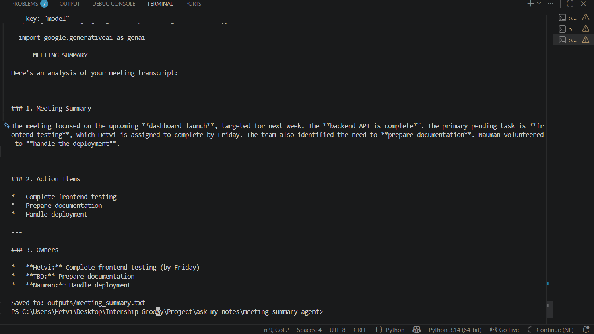
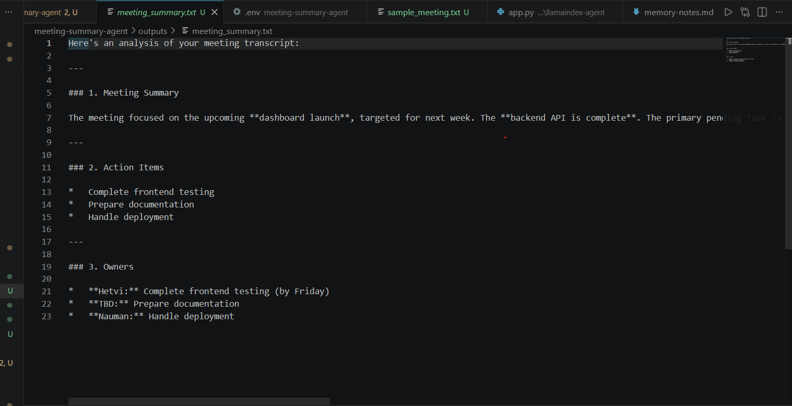
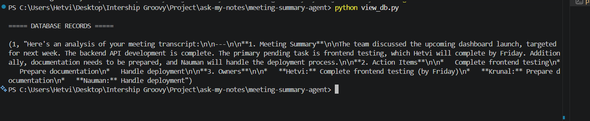
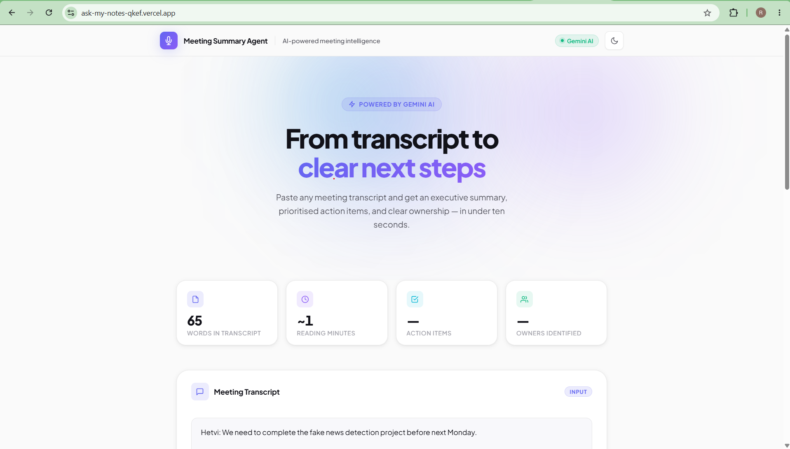
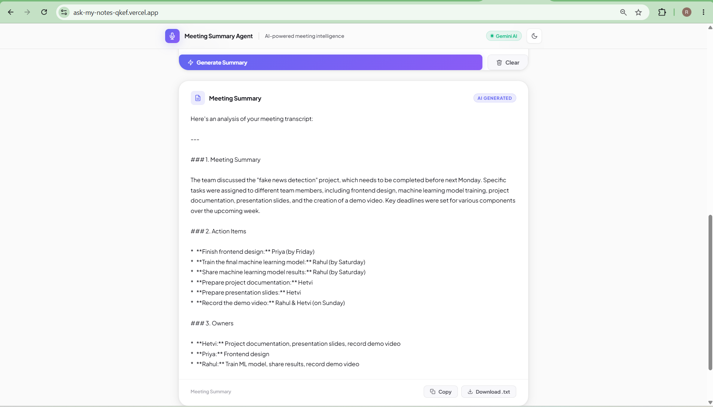
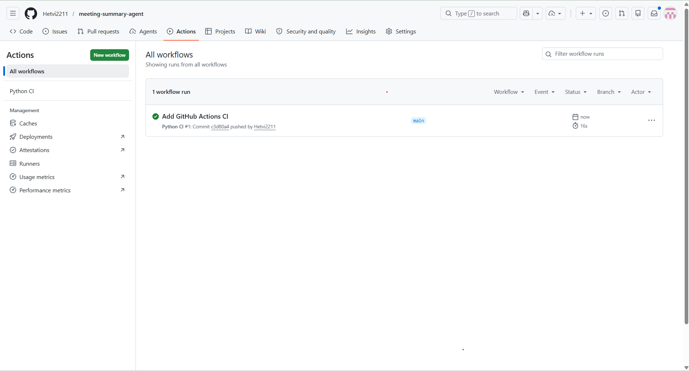
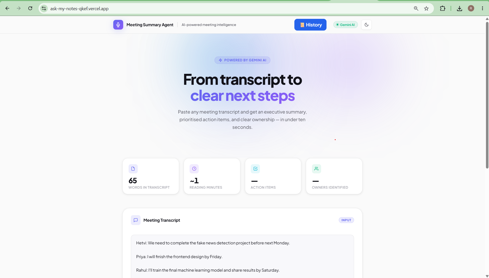
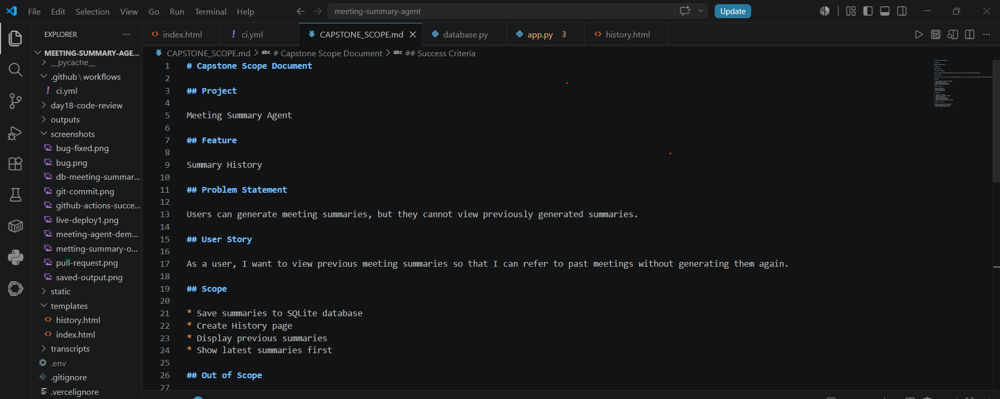
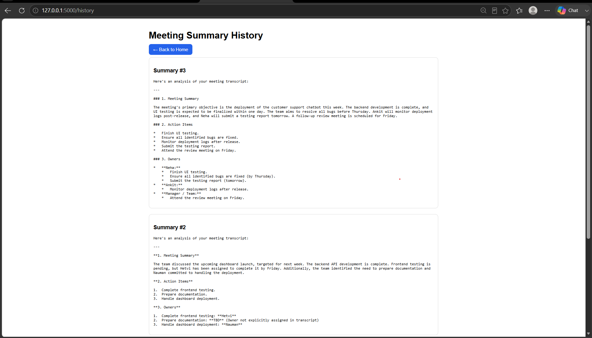

# Meeting Summary Agent

## Overview

Meeting Summary Agent is a custom AI agent built using Python and Google Gemini API.

The agent reads a meeting transcript, analyzes the discussion, extracts important information, and generates:

* Meeting Summary
* Action Items
* Owners/Assignees

The generated summary is saved to a text file and stored in a SQLite database for future reference.

---

## Features

* Transcript Analysis using Gemini
* Meeting Summary Generation
* Action Item Extraction
* Owner Identification
* Save Summary to Text File
* Save Summary to SQLite Database
* View Summary History
* Custom Agent Implementation (No Workflow Tools)

---

## Project Structure

meeting-summary-agent/

├── app.py

├── database.py

├── view_db.py

├── meeting_summaries.db

├── outputs/

│ └── meeting_summary.txt

└── transcripts/

└── sample_meeting.txt

---

## Tools Used

### Tool 1: Transcript Reader

Reads meeting transcripts from text files.

### Tool 2: Summary Storage

Stores generated summaries in:

* Text File
* SQLite Database

---

## Technologies

* Python
* Google Gemini API
* SQLite
* python-dotenv

---

## Sample Output

### Meeting Summary

The meeting focused on the upcoming dashboard launch scheduled for next week. Backend API development is complete. Frontend testing remains pending and must be completed by Friday. Documentation preparation is required. Deployment responsibilities were assigned.

### Action Items

* Complete frontend testing
* Prepare documentation
* Deploy application

### Owners

* Hetvi → Frontend Testing
* Nauman → Deployment
* Team → Documentation

---

## Day 20 Capstone Feature

### Feature: Summary History

Users can now access previously generated meeting summaries through a dedicated History page.

### User Flow

Generate Summary
↓
Save to SQLite Database
↓
Click History Button
↓
View Previously Generated Summaries

### Implementation

- Added database retrieval functionality
- Created `/history` route
- Added History page UI
- Display summaries in reverse chronological order
- Integrated with existing SQLite database

### Benefits

- Quick access to previous meeting summaries
- Improved user experience
- Persistent storage of generated outputs

---

## Screenshots

### Meeting agent

### Saved output

### Database Records

### Live Demo

### Meeting Summary

### Github Actions Success

### History 

### Capstone Scope

### History page

---

## Live Demo

Production URL:

https://ask-my-notes-qkef.vercel.app/

---

## Deployment

Platform: Vercel

SSL: Enabled Automatically

Status: Live

---

## CI/CD Pipeline

GitHub Actions automatically:

- Installs dependencies
- Verifies Flask app syntax
- Runs on every push
- Runs on Pull Requests

Workflow File:

.github/workflows/ci.yml

---

## How to Run

Install dependencies:

pip install -r requirements.txt

Create .env file:

GEMINI_API_KEY=your_api_key

Run agent:

python app.py

View database records:

python view_db.py

---

## What I Would Do With More Time

- Add user authentication
- Store summaries in database
- Export summaries as PDF
- Add file upload support
- Add meeting analytics dashboard
- Improve prompt engineering

---

# Day 21 - Capstone WIP

## Feature

Meeting Summary History

## Progress Completed

- Added SQLite summary storage
- Added get_all_summaries() function
- Created /history route
- Created history.html page
- Added navigation to history page
- Tested locally

## Current Status

Work In Progress

## Known Limitation

SQLite works locally.

Vercel serverless deployment does not provide persistent storage for SQLite databases.

Future version will migrate history storage to PostgreSQL or Supabase.

---
## Learning Outcomes

* Built a custom AI agent without workflow automation tools.
* Integrated Google Gemini API.
* Implemented tool usage within an agent workflow.
* Generated structured meeting summaries.
* Stored outputs in files and databases.
* Understood real-world AI agent architecture.

